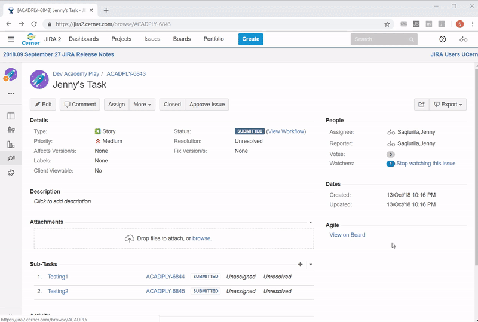

# Autofill Jira task label
In my team, we have to add a team label to every subtask that we create. It's annoying to have to fill it out every time or have to go back to add it after I forget to. So this extension will automatically add the label when creating a subtask.

## Limitations:
Can't manually add other labels in the Create Subtask view, too lazy to investigate further..