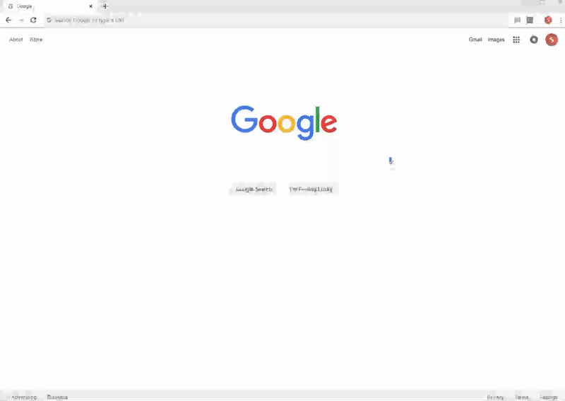

# myTime Automator
When visiting Cerner myTime, automatically opens up a new timesheet with last week's project codes, and fills Monday to Friday of the first row with 8's.

## How to use
* Clone the repo
* Visit chrome://extensions/, click on "Load unpacked" and select this folder