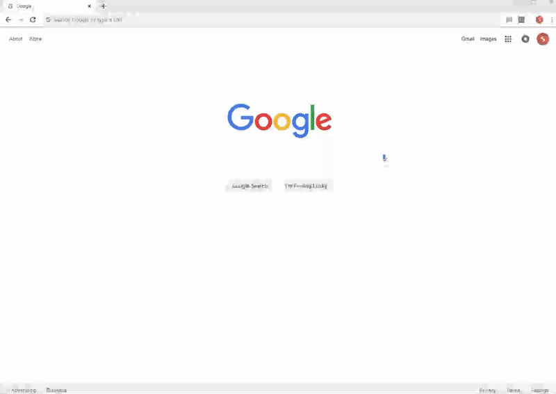
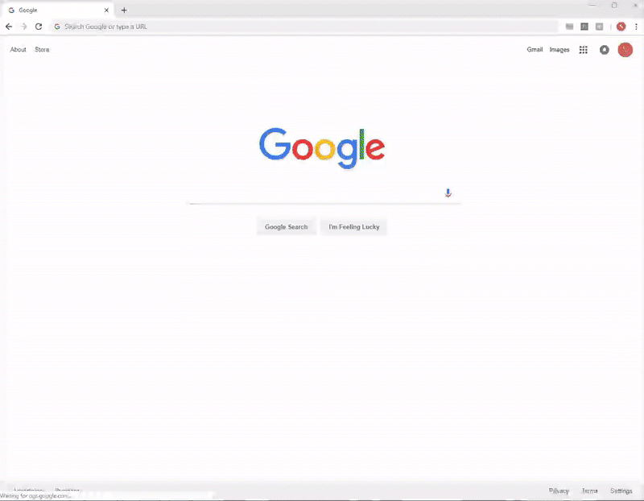

# myTime Automator
## 1st Submission
When visiting Cerner myTime, automatically opens up a new timesheet with last week's project codes, and fills Monday to Friday of the first row with 8's.

## 2nd Submission
On top of 1st submission, if there is a holiday(s) in that week, automatically add a row with holiday time code and hours.

(I set 10/17 and 10/18 as holidays for testing. Also I submitted two time codes last week, hence three rows in total.)

TODO: deal with when a week is from end of December to beginning of January.

## How to use
* Clone the repo
* Visit chrome://extensions/, click on "Load unpacked" and select this folder