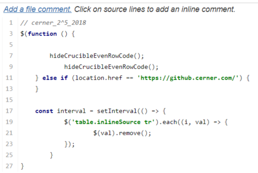

# Prankster
Prank friends and colleagues by installing this extension to their chrome.

## What it does
* Show images upside down

  

* In Crucible, hide every other line of code (the even number row)

  
  
* Redirect to github.com when try to visit github.cerner.com

## How to Use
* Clone the project to the victim's device.
* Go to the extension page (chrome://extensions/) in their chrome, click on "Load unpacked" on the upper left corner and select this folder.
* The extension will only work in newly opene/loaded webpages after you import it
