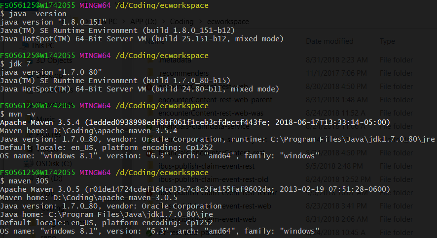

# Lazy Commands
Shortens/simplifies some commands.

I learned a bit about shell scripting while trying to set up ibus dev env with kamino, so in this practice project I used what I learned to make the commands we use everyday more concise.

## Usage
* For .sh files, add the scripts to your .bashrc by giving it an [alias](https://askubuntu.com/a/17538). e.g.,
  
  `alias lz=/c/.../lazy-commands/lazy.sh`

* For bashrc files: copy/paste the file content into .bashrc
* Special cases:
  * [to_git_root.sh](to_git_root.sh): `alias groot="source /c/.../lazy-commands/to_git_root.sh"`
  * [modify_jdk_mvn_version.bashrc](modify_jdk_mvn_version.bashrc): look inside this file for instructions
* Start using them by opening up the bash in any folder

## Commands
|        | Command        |  What it does  |
| :----: |:--------------:| -------------- |
| [lazy.sh](lazy.sh)| lz -gc --"\<msg>" | Stage the changed files and commit |
|        | lz -gp --"\<msg>" | Stage the changed files, commit and push |
|        | lz -mi         | mvn clean install[1] |
|        | lz -me         | mvn eclipse:eclipse[1] |
| [kill_port.sh](kill_port.sh) | kill --<port_numer> | Kill the process listening on a port |
| [to_git_root.sh](to_git_root.sh) | groot | Go back to the root directory of the git repo |
| [modify_jdk_mvn_version.bashrc](modify_jdk_mvn_version.bashrc) | jdk \<version> | Change the java version in current bash |
|        | maven \<version> | Change the maven version in current bash |
| [checkout_pull_request.bashrc](checkout_pull_request.bashrc) | pr <pr_id> | Checkout a pull request into a pr branch |

 
[1] Simple commands can be given aliases directly

## Demo
* Kill Port

  

* Go back to git repo root

  

* Change java and maven version in current bash

  

* Checkout a pull request into a pr branch

  